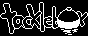

# Tackle Box

Imagine if the fishing part of Animal Crossing was its own game. That's essentially what Tackle Box will be once it is done. Although it will expand on the fishing mechanics a bit to make it more interesting.

## Status

The game is almost done. There's still a couple features to build yet. But the main remaining hurdle is balancing everything. How much should bait cost? How rare are the rare fish? Balancing so the game is fun might take some time.

## Screenshots and Gifs

